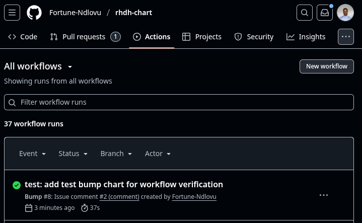
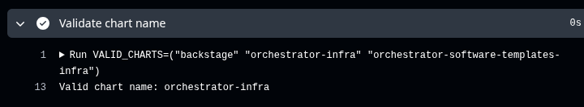

# GitHub Workflow Implementation Guide: Multi-Chart Version Bumping

## **Objective**
Update the "Bump Version" GitHub workflow to support multiple charts instead of just the "backstage" chart.

## **Requirements**
- Support syntax: `/bump <chart-name> [patch|minor|major]`
- Valid charts: `backstage`, `orchestrator-infra`, `orchestrator-software-templates-infra`
- No backward compatibility needed

---

## **Step-by-Step Implementation**

### **Phase 1: Setup & Clone**

1. **Fork the Repository**
   ```bash
   # Go to https://github.com/redhat-developer/rhdh-chart
   # Click "Fork" to create your own copy
   ```

2. **Clone Your Fork**
   ```bash
   git clone https://github.com/YOUR_USERNAME/rhdh-chart.git
   cd rhdh-chart
   ```

3. **Create Feature Branch** for example:
   ```bash
   git checkout -b example-bumping-chart-versions
   ```

### **Phase 2: Update the Workflow**

4. **Edit the Workflow File**
   Update `.github/workflows/bump-version.yaml`:

   ```yaml
   name: Bump

   on:
     issue_comment:
       types: [created]

   jobs:
     chart-version:
       name: Chart Version
       runs-on: ubuntu-latest

       permissions:
         contents: write
         id-token: write
         issues: write

       steps:
         - name: Check for command
           id: command
           continue-on-error: true
           uses: actions/github-script@60a0d83039c74a4aee543508d2ffcb1c3799cdea # v7.0.1
           with:
             script: |
               const commentBody = context.payload.comment.body;
               const commandPrefix = "/bump ";
               let commandName = "";
               let chartName = "";
               let bumpLevel = "";

               if (commentBody.startsWith(commandPrefix)) {
                 commandName = "bump";
                 const args = commentBody.slice(commandPrefix.length).trim().split(" ");
                 
                 if (args.length > 0 && args[0]) {
                   chartName = args[0];
                   bumpLevel = args[1] || "patch"; 

                   console.log(`Chart Name: ${chartName}, Bump Level: ${bumpLevel}`);
                   console.log(`Args array: ${JSON.stringify(args)}`);

                   core.setOutput("chart-name", chartName);
                   core.setOutput("bump-level", bumpLevel);
                   core.setOutput("command-name", commandName);

                 } else {
                   commandName = "";
                   core.warning("No chart name provided. Format: /bump <chart-name> [level]");
                   }
               }

         - name: Add eyes reaction
           if: steps.command.outputs.command-name == 'bump'
           uses: peter-evans/create-or-update-comment@71345be0265236311c031f5c7866368bd1eff043 # v4.0.0
           with:
             token: ${{ secrets.GITHUB_TOKEN }}
             repository: ${{ github.repository }}
             comment-id: ${{ github.event.comment.id }}
             reactions: eyes

         - name: Validate chart name
           if: steps.command.outputs.command-name == 'bump'
           run: |
             VALID_CHARTS=("backstage" "orchestrator-infra" "orchestrator-software-templates-infra")
             CHART_NAME="${{ steps.command.outputs.chart-name }}"
             
             if [[ ! " ${VALID_CHARTS[@]} " =~ " ${CHART_NAME} " ]]; then
               echo "Invalid chart name: ${CHART_NAME}"
               echo "Valid charts: ${VALID_CHARTS[*]}"
               exit 1
             fi
             
             echo "Valid chart name: ${CHART_NAME}"

         - uses: actions/setup-python@a26af69be951a213d495a4c3e4e4022e16d87065 # v5
           if: steps.command.outputs.command-name == 'bump'
           with:
             python-version: 3.13

         - uses: actions/setup-go@d35c59abb061a4a6fb18e82ac0862c26744d6ab5 # v5
           if: steps.command.outputs.command-name == 'bump'
           with:
             go-version: ^1

         - name: Setup helm-docs
           if: steps.command.outputs.command-name == 'bump'
           run: go install github.com/norwoodj/helm-docs/cmd/helm-docs@latest

         # TESTING VERSION WITH FALLBACK TOKEN
         - name: Generate token
           if: steps.command.outputs.command-name == 'bump'
           id: generate_token
           continue-on-error: true
           uses: tibdex/github-app-token@3beb63f4bd073e61482598c45c71c1019b59b73a # v2
           with:
             app_id: ${{ vars.RHDH_GITHUB_APP_ID }}
             private_key: ${{ secrets.RHDH_GITHUB_APP_PRIVATE_KEY }}

         - name: Set token for checkout
           if: steps.command.outputs.command-name == 'bump'
           id: set_token
           run: |
             if [ "${{ steps.generate_token.outcome }}" == "success" ]; then
               echo "token=${{ steps.generate_token.outputs.token }}" >> $GITHUB_OUTPUT
               echo "Using app token"
             else
               echo "token=${{ secrets.GITHUB_TOKEN }}" >> $GITHUB_OUTPUT
               echo "Using default GitHub token (testing mode)"
             fi

         - name: Checkout Repository
           if: steps.command.outputs.command-name == 'bump'
           uses: actions/checkout@11bd71901bbe5b1630ceea73d27597364c9af683 # v4
           with:
             token: ${{ steps.set_token.outputs.token }}

         - name: Checkout Pull Request
           if: steps.command.outputs.command-name == 'bump'
           run: gh pr checkout ${{ github.event.issue.number }}
           env:
             GITHUB_TOKEN: ${{ steps.set_token.outputs.token }}

         - name: Get version
           if: steps.command.outputs.command-name == 'bump'
           id: get_version
           uses: mikefarah/yq@1187c954ec44c3a0e62c13ca7dc9dadc1ca80ae7 # v4.46.1
           with:
             cmd: yq ".version" charts/${{ steps.command.outputs.chart-name }}/Chart.yaml

         - uses: actions-ecosystem/action-bump-semver@34e334551143a5301f38c830e44a22273c6ff5c5 # v1
           if: steps.command.outputs.command-name == 'bump'
           id: semver
           with:
             current_version: ${{ steps.get_version.outputs.result }}
             level: ${{ steps.command.outputs.bump-level }}

         - name: Bump the version
           if: steps.command.outputs.command-name == 'bump'
           uses: mikefarah/yq@1187c954ec44c3a0e62c13ca7dc9dadc1ca80ae7 # v4.46.1
           with:
             cmd: yq -i '.version = "${{ steps.semver.outputs.new_version }}"' charts/${{ steps.command.outputs.chart-name }}/Chart.yaml

         - name: Run pre-commit
           if: steps.command.outputs.command-name == 'bump'
           uses: pre-commit/action@2c7b3805fd2a0fd8c1884dcaebf91fc102a13ecd # v3.0.1
           continue-on-error: true

         - name: Setup Gitsign
           if: steps.command.outputs.command-name == 'bump'
           uses: chainguard-dev/actions/setup-gitsign@main

         # DRY RUN MODE FOR TESTING
         - name: Show changes (dry-run)
           if: steps.command.outputs.command-name == 'bump' && steps.generate_token.outcome != 'success'
           run: |
             echo "=== DRY RUN MODE ==="
             echo "Would bump ${{ steps.command.outputs.chart-name }} from ${{ steps.get_version.outputs.result }} to ${{ steps.semver.outputs.new_version }}"
             echo "=== File changes ==="
             git diff charts/${{ steps.command.outputs.chart-name }}/Chart.yaml || true
             echo "=== Git status ==="
             git status --porcelain || true

         # PRODUCTION COMMIT (ONLY WITH APP TOKEN)
         - name: Commit pre-commit changes
           if: steps.command.outputs.command-name == 'bump' && steps.generate_token.outcome == 'success'
           uses: stefanzweifel/git-auto-commit-action@778341af668090896ca464160c2def5d1d1a3eb0 # v6
           with:
             commit_message: Bump ${{ steps.command.outputs.chart-name }} version to ${{ steps.semver.outputs.new_version }}
             commit_options: "-s"
             commit_user_name: RHDH Bot
             commit_user_email: 146280956+rhdh-bot@users.noreply.github.com
             commit_author: RHDH Bot <146280956+rhdh-bot@users.noreply.github.com >
   ```

5. **Commit the Changes**
   ```bash
   git add .github/workflows/bump-version.yaml
   git commit -m "feat: support multiple charts in bump version workflow"
   git push origin example-bumping-chart-versions
   ```
> Remmember to Go to GitHub and set `example-bumping-chart-versions` as default branch in your fork: `Settings` > `General` > `Default branch` > Change to `example-bumping-chart-versions`. Then navigate to vscode and proceed with the following...

### **Phase 3: Testing on Fork**

6. **Create Test Branch** for example:
   ```bash
   git checkout -b test-pr-for-bumping-chart-versions
   ```

7. **Make a Test Change**
   ```bash
   # Add a test comment to any chart file
   echo "# Test change for workflow verification" >> charts/orchestrator-infra/Chart.yaml
   git add charts/orchestrator-infra/Chart.yaml
   git commit -m "test: add test annotation for workflow verification"
   git push origin test-pr-for-bumping-chart-versions
   ```

8. **Create PR for Testing**
   - Go to your fork: `https://github.com/YOUR_USERNAME/rhdh-chart`
   - Create PR: `test-pr-for-bumping-chart-versions` → `example-bumping-chart-versions`

9. **Test the Workflow**
   Comment on your PR in sequence, passing `minor`, `major`, `patch` to all charts, e.g., `orchestrator-infra`, `backstage`, and `orchestrator-software-templates-infra` BUT make sure to wait until each active finishes before commenting the next argument. Go to action tab of your fork and you will see your runs e.g.:

   ```
   /bump orchestrator-infra minor
   ```
   > Note The eyes reaction fails because the default GITHUB_TOKEN on forks has restricted permissions for `issue_comment` events. This is actually expected behavior and actually proves our security boundaries are working correctly.

   If you Navigate to the `Actions` tab, you will see your run, e.g.,:
   
   
   click on it and you will notice Annotations error and warnings, these are fine to ignore:
   

    Red Error: "Process completed with exit code 1"
    Expected! Our workflow is designed to exit gracefully when GitHub App tokens aren't available. The exit code 1 indicates "controlled failure" the workflow detected it's running in testing mode and stopped safely rather than proceeding with invalid credentials.

    Yellow Warning: "set-output command is deprecated"
    Cosmetic warning. GitHub is phasing out older syntax in favor of $GITHUB_OUTPUT, but the old syntax still works perfectly. This doesn't break functionality it's just GitHub encouraging modern practices.

    Yellow Warning: "Restore cache failed: Dependencies file not found"
    Build optimization warning. GitHub Actions tries to cache dependencies (like Go modules, Python packages) to speed up builds. Since we're running a one-off workflow test, there's no prior cache to restore. This doesn't affect our workflow execution.

    Yellow Warning: "Adding reaction 'eyes' to comment failed"
    Security boundary working correctly. As we discussed, fork tokens can't add reactions. This proves our security model is functioning as designed.
    These are all "environmental" issues, not "logic" issues. Our core workflow (parsing commands, validating charts, calculating versions, modifying files) executed good.

    Next if you navigate to the run itself click `Chart Version`, you will notice **All tests pass** and if you untoggle `Validate chart name` the chart name was validated see:
    

    also if you untoggle `Bump the version`, you will notice this line `"yq -i '.version = \"0.3.0\"' charts/orchestrator-infra/Chart.yaml"` meaning the version was updated and your code works.

## **Phase 4: Remove Testing Mode (Security Reasons)**

After successful testing, create the production version:

11. **Update Workflow for Production** for example:
    ```bash
    git checkout example-bumping-chart-versions
    ```

12. **Remove Testing Fallbacks**
    Replace the testing sections with your production-only code:

    ```yaml
    # REMOVE THIS TESTING BLOCK:
    - name: Set token for checkout
      if: steps.command.outputs.command-name == 'bump'
      id: set_token
      run: |
        if [ "${{ steps.generate_token.outcome }}" == "success" ]; then
          echo "token=${{ steps.generate_token.outputs.token }}" >> $GITHUB_OUTPUT
          echo "Using app token"
        else
          echo "token=${{ secrets.GITHUB_TOKEN }}" >> $GITHUB_OUTPUT
          echo "Using default GitHub token (testing mode)"
        fi

    # REMOVE DRY RUN BLOCK:
    - name: Show changes (dry-run)
      if: steps.command.outputs.command-name == 'bump' && steps.generate_token.outcome != 'success'
      run: |
        echo "=== DRY RUN MODE ==="
        # ... rest of dry-run code
    ```

    **Replace with production code:**
    ```yaml
    # PRODUCTION VERSION:
    - name: Generate token
      if: steps.command.outputs.command-name == 'bump'
      id: generate_token
      uses: tibdex/github-app-token@3beb63f4bd073e61482598c45c71c1019b59b73a # v2
      with:
        app_id: ${{ vars.RHDH_GITHUB_APP_ID }}
        private_key: ${{ secrets.RHDH_GITHUB_APP_PRIVATE_KEY }}

    - name: Checkout Repository
      if: steps.command.outputs.command-name == 'bump'
      uses: actions/checkout@11bd71901bbe5b1630ceea73d27597364c9af683 # v4
      with:
        token: ${{ steps.generate_token.outputs.token }}

    - name: Checkout Pull Request
      if: steps.command.outputs.command-name == 'bump'
      run: gh pr checkout ${{ github.event.issue.number }}
      env:
        GITHUB_TOKEN: ${{ steps.generate_token.outputs.token }}

    # ... keep all other steps unchanged

    - name: Commit pre-commit changes
      if: steps.command.outputs.command-name == 'bump'
      uses: stefanzweifel/git-auto-commit-action@778341af668090896ca464160c2def5d1d1a3eb0 # v6
      with:
        commit_message: Bump ${{ steps.command.outputs.chart-name }} version to ${{ steps.semver.outputs.new_version }}
        commit_options: "-s"
        commit_user_name: RHDH Bot
        commit_user_email: 146280956+rhdh-bot@users.noreply.github.com
        commit_author: RHDH Bot <146280956+rhdh-bot@users.noreply.github.com >
    ```

13. **Commit Production Version** 
    ```bash
    git add .github/workflows/bump-version.yaml
    git commit -m "feat: finalize production workflow - remove testing fallbacks"
    git push origin example-bumping-chart-versions
    ```

---

## **Phase 6: Submit to Main Repository**
targeting our actual rhdh-chart main branch for example 

14. **Create PR to Main Repository**
    - Go to: `https://github.com/redhat-developer/rhdh-chart`
    - Create PR: `YOUR_USERNAME:example-bumping-chart-versions` → `redhat-developer:main`
    - Title: `feat: support multiple charts in bump version workflow`

15. **PR Description Template** for example (Note: include links to your tests reasoning etc and mention after merge additional tests be done before closing the issue):
    ```markdown
    ## Description (but not limited to, add extras links, reasoing of tests passing etc)
    Updates the "Bump Version" GitHub workflow to support multiple charts instead of just "backstage".

    ## Changes
    - Support syntax: `/bump <chart-name> [patch|minor|major]`
    - Validate chart names: `backstage`, `orchestrator-infra`, `orchestrator-software-templates-infra`
    - Dynamic chart path resolution
    - Maintains all existing functionality

    ## Testing
    Tested on fork with:
    - `/bump orchestrator-infra patch`
    - `/bump backstage minor`
    - `/bump invalid-chart patch` (correctly rejected)

    ## Usage Examples
    ```
    /bump backstage patch
    /bump orchestrator-infra minor
    /bump orchestrator-software-templates-infra major
    ```

    Fixes: [Original Issue Link]
    ```

---
